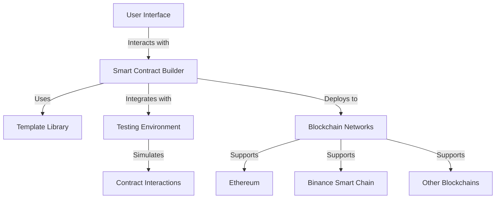

# PharosForge: Visual Drag and Drop Smart Contract Builder tool for Pharos Network

## Tagline
**Empowering Developers to Create, Deploy, and Manage Smart Contracts on Pharos Effortlessly.**

## Description
PharosForge is a powerful, user-friendly application for building, deploying, and managing smart contracts on the Pharos Network. This visual drag-and-drop interface allows developers to create complex smart contract workflows with minimal coding knowledge.

## Problem Statement
In the rapidly evolving world of blockchain technology, developers face numerous challenges when creating and deploying smart contracts. These challenges include complex coding requirements, lack of user-friendly interfaces, and difficulties in testing and deploying contracts across multiple blockchain platforms. As a result, many developers struggle to bring their ideas to life efficiently.

## Solution Statement
The ** Pharos Smart Contract Builder** addresses these challenges by providing a comprehensive, user-friendly platform that simplifies the entire smart contract development process. With pre-built templates, testing tools, and multi-blockchain support, developers can focus on innovation rather than the intricacies of coding and deployment.

## Features
- **User-Friendly Interface**: Intuitive design for seamless navigation and contract creation.
- **Pharos Support**: Build and Deploy contracts on Pharos with ease.
- **Template Library**: Access to pre-built templates for common contract types (ERC20, ERC721, etc.).
- **Testing Environment**: Built-in tools to simulate contract interactions and ensure functionality.
- **Deployment Tools**: Step-by-step guidance for deploying contracts on various blockchains.
- **Version Control**: Track contract versions and changes easily.
- **Visual Contract Builder**: Intuitive drag-and-drop interface for designing contract functionality
- **Pharos Integration**: Deploy directly to Pharos Devnet with a single click
- **Built-in Templates**: Access contract templates for various use cases
- **Live Preview**: See your contract code generated in real-time
- **Transaction Explorer**: View your deployed contracts and transactions

## Architecture Diagram


## Installation
To get started with the Smart Contract Builder, follow these steps:

### Installation

1. Clone the repository
```bash
git clone https://github.com/degenbuilder7/pharos-forge.git
cd pharos-forge
```

2. Install dependencies
```bash
npm install
# or
yarn install
```

3. Run the development server
```bash
npm run dev
# or
yarn dev
```

4. Open [http://localhost:3000](http://localhost:3000) with your browser to see the result.

## Connecting to Pharos Network

PharosForge is configured to connect to the Pharos Devnet by default. Make sure to configure your MetaMask wallet with the following network settings:

- **Network Name**: Pharos Devnet
- **RPC URL**: https://devnet.dplabs-internal.com
- **Chain ID**: 50002
- **Currency Symbol**: ETH

## Contributing

Contributions are welcome! Please feel free to submit a Pull Request.

## License

This project is licensed under the MIT License - see the LICENSE file for details.

## Acknowledgments

- Pharos Network for the blockchain infrastructure
- Pendle Finance for DeFi integrations
- All the amazing open-source projects that made this possible
